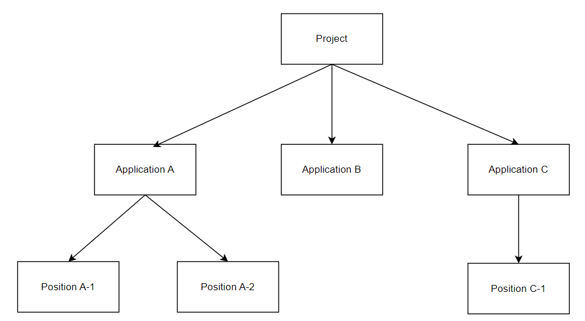
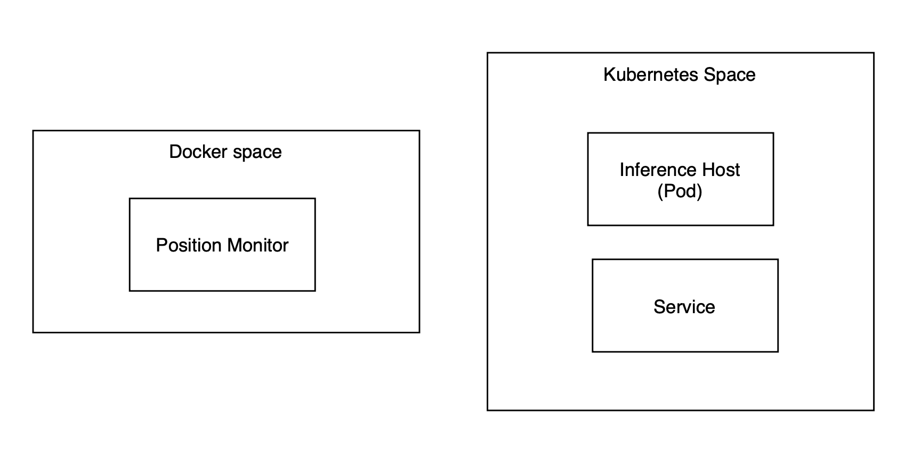

# 抽象類別階層

無論是訓練平台還是部署平台，都是由抽象類別進行管理。透過這種層級結構，模型的生命週期和推理流程能夠有序進行。

### **Projects**

專案（Projects）是一個頂層的抽象類別，包含了組織中由專案經理管理的多個應用程式。

### **Applications**

應用（Applications）是專案中的一個抽象類別，用來區分不同的目標，例如同屬無人機專案之鐘的無人機路徑預測或無人機電池預測。你可以在相同應用程式內選擇表現最佳的模型。

### **Positions**

位置（Positions）是一個在部署平台上非常重要的類別。它相對於部署平台而言是相當獨立的，這意味著部署平台和邊緣伺服器可以分別建置在不同的虛擬機甚至不同的實體伺服器上。位置的特性讓使用者能夠將模型部署至靠近xApp所在位置的邊緣伺服器。

Positions的目標有下列幾點：

- 降低部屬時間
- 分類整個推論服務
- 監測推論任務的狀態與生命週期

**補充資訊**

位置（Position）既不是檔案也不是Process，而是一個由多個Process組成的推論服務。這些Process位於兩個空間中：Docker 空間和 Kubernetes 空間。位置內的組成部分包括：

1. Position Monitor
2. Inference Host
3. Kubernetes Service

**Position Monitor**

部署平台是使用者觸發監控和命令介面的地方。為了妥善管理位置，Position Monitor將成為使用者了解邊緣伺服器 CPU 和記憶體資源使用率的有用工具。此外，inference host在未來版本將具備擴展性。因此，Position Monitor負責每個Position的水平 Pod 自動擴展（HPA）以及inference host內的模型管理。

**Inference Host**

inference host是實際進行推理任務的地方。inference host由inference template和model 組成。使用者只需要使用我們的範本來實作功能，或者按照介面來建立自己的模板。詳細資訊請參閱頁面 [**Let's start to build an inference host! (未完成)**](https://www.notion.so/Let-s-start-to-build-an-inference-host-e0fca45d96eb4ad3b37c90d3239cda01?pvs=21) ！

**Kubernetes Service**

Pod 是 Kubernetes 叢集架構中的一種資源類別。一個 Pod 由一個或多個容器組成以形成微服務。當 Pod 啟用時，主節點會分配一個叢集 IP。儘管 Pod 可以動態部署到不同的工作節點，但叢集 IP 會頻繁變更，導致系統不穩定。因此，我們需要 Kubernetes 的服務來幫助我們透過標籤和選擇器將請求發送到特定的微服務。

此外，Kubernetes 提供了三種服務類型：NodePort、ClusterIP 和 LoadBalancer 模式。在我們的部署平台中，我們使用 LoadBalancer 模式來實現簡單的負載均衡功能。