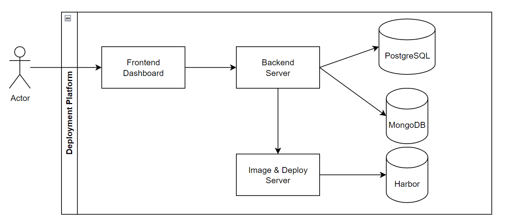
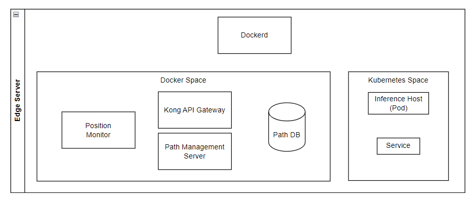

# 部屬平台（Deployment Platform）

部署平台的目標是將模型部署到邊緣伺服器上進行推理任務。通過這個過程，使用者可以從模型訓練後直接管理實際應用的整個模型生命週期，並降低部署的難度。部署平台還會從訓練平台訂閱模型的相關資訊。

# 邊緣伺服器（Edge Server）

邊緣伺服器是實際執行推理任務的地方。推理主機、Kubernetes 服務和位置監控（Position Monitor）這些位置（Position）的組成部分也包含在邊緣伺服器中。

以下展示了邊緣伺服器的架構。

除了位置（Position）之外，我們還設計了閘道系統來管理請求路徑。在設計 xApp 時，使用者只需專注於他們的功能。有了我們的 SDK，所有與請求 URL 相關的部分都會由 SDK 以及Kong Gateway 負責處理。

### **Kong Gateway**

Kong Gateway 是一個輕量級、快速且靈活的雲原生 API 閘道。API 閘道是一種反向代理，允許您管理、配置和路由請求到您的 API

reference: [https://docs.konghq.com/gateway/latest/](https://docs.konghq.com/gateway/latest/)